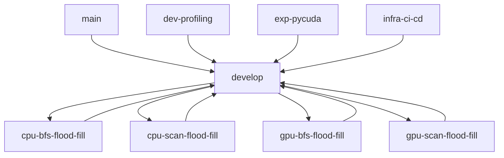

# CUDA Flood Fill - Evolution Roadmap 🚀

> **Vision**: Demonstrate the evolution from simple sequential CPU algorithms to complex parallel GPU implementations

## 🎯 Project Philosophy

This project showcases the journey from simple to complex, sequential to parallel:

1. **Start Simple**: Begin with a basic CPU BFS that anyone can understand
2. **Add Complexity**: Show how more sophisticated algorithms (scan) work on CPU
3. **Introduce Parallelism**: Move the simple algorithm to GPU
4. **Optimize**: Combine the best of both worlds (GPU + advanced algorithms)

## 📖 Evolution Path (The Main Story)

### Step 1: `cpu-bfs-flood-fill` - The Foundation 🌱
**Goal**: Create the simplest possible flood-fill implementation

- **Algorithm**: Basic Breadth-First Search (BFS)
- **Platform**: CPU (Sequential)
- **Focus**: Clarity and correctness
- **Deliverables**:
  - Simple, readable BFS implementation
  - Basic visualization
  - Performance baseline
  - Documentation explaining the algorithm

**Key Learning**: Understanding the core flood-fill problem

### Step 2: `cpu-scan-flood-fill` - Algorithm Evolution 🧠
**Goal**: Introduce more sophisticated algorithms while staying on CPU

- **Algorithm**: Connected Component Labeling with scanning techniques
- **Platform**: CPU (Still sequential, but more advanced)
- **Focus**: Algorithm sophistication
- **Deliverables**:
  - Scan-based flood fill implementation
  - Comparison with BFS approach
  - Performance analysis (algorithm complexity)
  - Documentation of scan techniques

**Key Learning**: How algorithm choice affects performance, even on the same hardware

### Step 3: `gpu-bfs-flood-fill` - Platform Evolution ⚡
**Goal**: Take the simple algorithm and make it parallel

- **Algorithm**: BFS (same as Step 1)
- **Platform**: GPU (Parallel)
- **Focus**: Parallelization strategies
- **Deliverables**:
  - CUDA kernel for parallel BFS
  - Memory management strategies
  - Thread block optimization
  - Performance comparison with CPU version

**Key Learning**: How parallelization can speed up the same algorithm

### Step 4: `gpu-scan-flood-fill` - Full Optimization 🏆
**Goal**: Combine the best algorithms with the best hardware

- **Algorithm**: Advanced scanning techniques
- **Platform**: GPU (Fully optimized)
- **Focus**: Maximum performance
- **Deliverables**:
  - Optimized CUDA kernels
  - Advanced memory usage patterns
  - Benchmark suite
  - Performance analysis report

**Key Learning**: How hardware and algorithms work together for optimal performance

## 🔧 Supporting Development

### Development Branches (`dev-*`)
- `dev-profiling`: Performance measurement and analysis tools
- `dev-optimization`: General optimization experiments
- `dev-memory-optimization`: Memory usage optimization
- `dev-documentation`: Documentation improvements
- `dev-testing`: Test suite development

### Experimental Branches (`exp-*`)
- `exp-pycuda`: Alternative CUDA binding experiments
- `exp-cupy`: CuPy-based implementations
- `exp-two-pass-algorithm`: Alternative algorithm approaches

### Infrastructure Branches (`infra-*`)
- `infra-project-setup`: Build system and project configuration
- `infra-poetry-setup`: Dependency management
- `infra-ci-cd`: Continuous integration setup

## 📊 Benchmarking Strategy

### Performance Metrics to Track
1. **Execution Time**: How fast each approach runs
2. **Memory Usage**: Peak and average memory consumption (out of 8 GB)
3. **GPU Utilization**: SM occupancy and throughput efficiency
4. **Memory Bandwidth**: Utilization of 128-bit GDDR6 bus
5. **Scalability**: Performance with different image sizes
6. **Thread Efficiency**: Warp utilization and divergence analysis
7. **Shared Memory Usage**: Efficiency of 48 KB per block allocation

### Comparison Matrix
```
                │ CPU BFS │ CPU Scan │ GPU BFS │ GPU Scan │
────────────────┼─────────┼──────────┼─────────┼──────────┤
Simplicity      │    ⭐⭐⭐⭐⭐ │    ⭐⭐⭐    │   ⭐⭐⭐   │    ⭐⭐    │
Speed (Small)   │    ⭐⭐   │    ⭐⭐⭐   │   ⭐⭐⭐   │   ⭐⭐⭐⭐  │
Speed (Large)   │    ⭐    │    ⭐⭐    │   ⭐⭐⭐⭐  │   ⭐⭐⭐⭐⭐ │
Memory Usage    │   ⭐⭐⭐⭐  │   ⭐⭐⭐⭐   │   ⭐⭐⭐   │    ⭐⭐   │
```

## � Target Hardware: NVIDIA RTX 4060 Laptop GPU

### GPU Specifications
- **Device**: NVIDIA GeForce RTX 4060 Laptop GPU
- **Architecture**: Ada Lovelace
- **Compute Capability**: 8.9
- **Total Memory**: 8.00 GB GDDR6
- **Memory Bus Width**: 128-bit
- **Memory Clock**: 8001 MHz
- **Base Clock**: 1470 MHz

### Technical Architecture Details

#### Streaming Multiprocessors (SMs)
- **SM Count**: 24 Streaming Multiprocessors
- **Max Threads per Block**: 1024
- **Max Block Dimensions**: (1024, 1024, 64)
- **Warp Size**: 32 threads
- **Max Registers per Block**: 65,536
- **Max Registers per SM**: 65,536

#### Memory Hierarchy
```
┌─────────────────────────────────────────────────────────────┐
│                    Global Memory (8 GB)                     │
├─────────────────────────────────────────────────────────────┤
│                   L2 Cache (32 MB)                         │
├─────────────────────────────────────────────────────────────┤
│  Shared Memory per Block: 48 KB (up to 99 KB with opt-in)  │
├─────────────────────────────────────────────────────────────┤
│          Constant Memory: 64 KB (cached)                   │
├─────────────────────────────────────────────────────────────┤
│               Registers: 65,536 per block                  │
└─────────────────────────────────────────────────────────────┘
```

#### Optimization Guidelines for RTX 4060
- **Optimal Thread Block Sizes**: 256, 512, or 1024 threads
- **Shared Memory Strategy**: Up to 48 KB per block (99 KB with opt-in)
- **Grid Sizing**: Consider 24 SMs for optimal occupancy
- **Memory Bandwidth**: 128-bit bus optimized for GDDR6
- **Concurrent Kernels**: Supported for overlapping execution

### CUDA Programming Model Context

#### Thread Hierarchy
```
Grid (up to 2^31-1 × 65,535 × 65,535)
├── Block (up to 1024 × 1024 × 64)
    ├── Warp (32 threads - execution unit)
    └── Thread (individual processing unit)
```

#### Memory Access Patterns
- **Coalesced Access**: Maximize memory throughput with aligned, contiguous access
- **Shared Memory Banks**: 32 banks, avoid bank conflicts
- **Texture Cache**: Available for 2D spatial locality
- **Constant Cache**: Optimized for uniform access across warps

### Implementation Considerations for Flood Fill

#### Thread Block Design
```cuda
// Optimal configurations for RTX 4060
Block Size Options:
├── 16×16 = 256 threads (good for 2D problems)
├── 32×16 = 512 threads (balanced approach)  
└── 32×32 = 1024 threads (maximum occupancy)
```

#### Memory Usage Strategy
- **Global Memory**: Store input/output images (utilize 8 GB capacity)
- **Shared Memory**: Queue storage for BFS (48 KB per block)
- **Constant Memory**: Direction vectors and small lookup tables (64 KB)
- **Registers**: Temporary variables and loop counters (65K per block)

#### Parallelization Challenges
1. **Load Balancing**: Different blob sizes create uneven work distribution
2. **Memory Coalescing**: 2D image access patterns can cause uncoalesced reads
3. **Thread Divergence**: Conditional processing based on pixel colors
4. **Synchronization**: Coordinating queue operations across threads
5. **Occupancy**: Balancing register usage vs. thread count per SM

## 🚀 Implementation Phases

### Phase 1: Foundation
- [ ] Implement `cpu-bfs-flood-fill`
- [ ] Create basic test images
- [ ] Set up benchmarking framework
- [ ] Document the BFS algorithm

### Phase 2: Algorithm Evolution
- [ ] Implement `cpu-scan-flood-fill`
- [ ] Compare algorithms on CPU
- [ ] Document scanning techniques
- [ ] Create performance comparison

### Phase 3: Parallelization
- [ ] Implement `gpu-bfs-flood-fill`
- [ ] Optimize CUDA kernels for RTX 4060
- [ ] Memory management optimization
- [ ] GPU vs CPU performance analysis

### Phase 4: Full Optimization
- [ ] Implement `gpu-scan-flood-fill`
- [ ] Advanced CUDA optimizations for Ada Lovelace
- [ ] Complete benchmark suite
- [ ] Final performance report

### Phase 5: Polish & Documentation
- [ ] Complete documentation
- [ ] Create demo notebooks
- [ ] Performance visualization
- [ ] Project presentation materials

## 📚 Educational Value

### For Beginners
- Start with `cpu-bfs-flood-fill` to understand the problem
- See clear, simple code that solves the problem
- Learn basic flood-fill concepts

### For Intermediate Developers
- Progress through `cpu-scan-flood-fill` to see algorithm alternatives
- Understand how algorithm choice affects performance
- Learn about connected component labeling

### For Advanced Developers
- Dive into `gpu-bfs-flood-fill` for parallelization techniques
- Master `gpu-scan-flood-fill` for high-performance computing
- Understand memory optimization and CUDA best practices

## 🎓 Learning Outcomes

By the end of this evolution path, developers will understand:

1. **Problem Decomposition**: How to break down a complex problem
2. **Algorithm Selection**: When to use different algorithms
3. **Platform Migration**: How to move from CPU to GPU
4. **Performance Optimization**: Memory, threading, and hardware optimization
5. **Benchmarking**: How to measure and compare performance
6. **Real-world Trade-offs**: Complexity vs. performance vs. maintainability

## 🔄 Branch Workflow



## 🏁 Success Criteria

- [ ] All four evolution steps implemented and documented
- [ ] Clear performance progression demonstrated
- [ ] Educational materials created for each step
- [ ] Comprehensive benchmark results
- [ ] Working demo for each evolution step
- [ ] Documentation that tells the complete story

---

*This roadmap ensures that every step builds logically on the previous one, creating a compelling narrative of optimization and scaling.*
