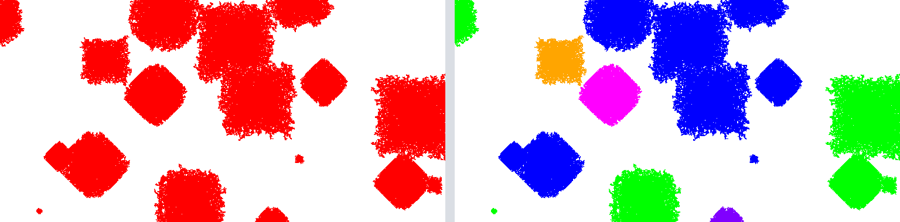
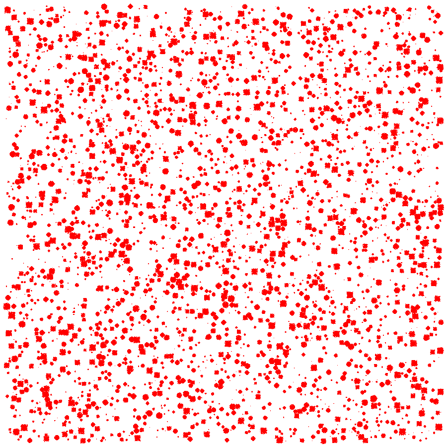
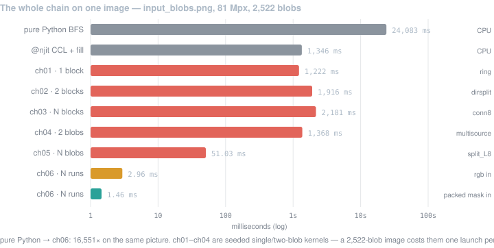
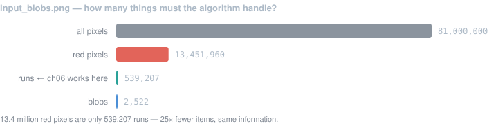
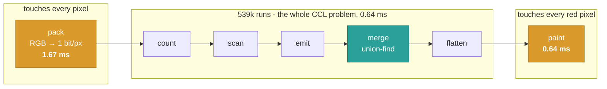
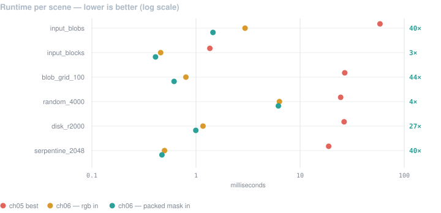
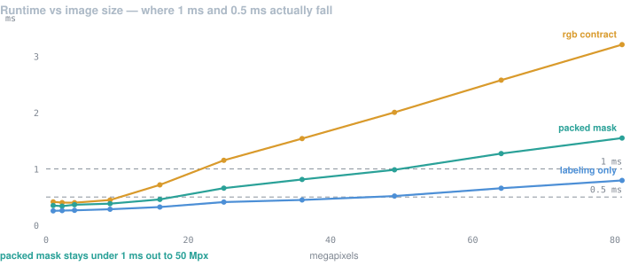

# flood-fill-cuda

Find every red blob in an image and recolor it - on the GPU, in CUDA +
Numba, built up over six chapters from a sequential CPU BFS.

Every kernel is pixel-exact against a CPU oracle. Every number is a
committed benchmark JSON, measured on an RTX 4060 Laptop (24 SMs).

**The real story:
[`chapters/README.md`](src/flood_fill_cuda/chapters/README.md)** - a
living document: inherited problems → approaches tried → measured
results → new problems exposed.



*A crop of the real `input_blobs.png` (left) and what the kernel returns
for it (right). The recolor ran on the whole 81 Mpx image - 2,522 blobs,
**1.46 ms**. Colours repeat every 6 blobs: the label map, not the paint,
is ground truth.*

---

## The chain

Each chapter answers the previous one's **measured** weakness.


```mermaid
flowchart LR
    A["CPU BFS"] -->|"one core<br/>is serial"| B["1 block"]
    B -->|"one SM is 4%<br/>of the GPU"| C["2 blocks"]
    C -->|"2 SMs<br/>are 8%"| D["N blocks"]
    D -->|"one blob<br/>is one BFS"| E["2 blobs"]
    E -->|"who finds<br/>the seeds?"| F["N blobs"]
    F -->|"why move<br/>pixels at all?"| G["N runs"]
    style G fill:#2aa198,stroke:#1d7c74,color:#fff
```

## The chapters

| # | Question | What it built | Headline |
|---|---|---|---|
| **1** | One core is serial | Level-synchronous BFS in one block; shared-memory ring + global spill tier | 2.03× the CPU at 36 Mpx |
| **2** | One SM is 4% of the GPU | Two blocks, three ways to split the work | 2.10× ch1; the plainest design won |
| **3** | Does it keep scaling? | N co-resident blocks, grid-wide barriers, 8-connectivity | 64 Mpx in 100 ms; plateau found at 512 threads/SM |
| **4** | One blob is one BFS | Two blobs in one launch, labels inside the queue entry | 1.05-2.05× vs two sequential launches |
| **5** | Who finds the seeds? | Seedless discovery: candidate waves + atomicMin union-find | **755,577 blobs in 24.8 ms**, one launch, zero seeds |
| **6** | Why move pixels at all? | Runs, not pixels - run-table connected components | **58 ms → 1.46 ms** on the 81 Mpx image |

<p align="center">
  
</p>

*Chapter 5 filling `input_blobs.png` - all 2,522 blobs discovered and
flooding at once, each in its own colour, from a single launch with no
seeds given. This is a replay of the recorded depth map (5 MB, 75
frames). Chapter 6 has no such picture, and that is the point: it is not
a BFS, so there is no wavefront to record.*

### Every stage on the same image



`input_blobs.png` is the one picture every stage was asked to do, so the
whole chain is directly comparable - **16,551× end to end**.

Two things the chart is careful about:

- **ch01-ch04 look slow here on purpose.** They are seeded single- or
  two-blob kernels, so a 2,522-blob image costs them one launch *per
  blob*. That is measured, not estimated, and it is what using that
  stage would really cost. It is also why ch02 and ch03 sit *above*
  ch01 - more blocks per launch does not help when the launch itself is
  the unit being repeated 2,522 times.
- **The ch06 bars come from a different session** than the rest (±8%
  clock spread on this laptop). The smallest gap on the chart is 35×,
  so it cannot change a conclusion.

---

## Chapter 6 - the current best

Chapters 1-5 optimize *how* pixels move. Chapter 6 changes **what moves**.

A **run** is a maximal red span inside one row. `input_blobs.png` is
9000 × 9000, and this is the whole idea:



**25× fewer things to work with.** Connectivity, labels and the paint
spans are all facts about *runs*, so the whole connected-components
problem shrinks to 539k items - and the clock collapses onto the only
two things that still touch pixels: one read, one write.

### The pipeline

Six plain kernels, stream-ordered. No cooperative launch, so no
residency cap:


```mermaid
flowchart LR
    subgraph hot ["touches every pixel"]
        P["pack<br/>RGB → 1 bit/px<br/><b>1.67 ms</b>"]
    end
    subgraph cold ["539k runs - the whole CCL problem, 0.64 ms"]
        C["count"] --> S["scan"] --> E["emit"] --> M["merge<br/>union-find"] --> F["flatten"]
    end
    subgraph hot2 ["touches every red pixel"]
        A["paint<br/><b>0.64 ms</b>"]
    end
    P --> C
    F --> A
    style P fill:#d99a2b,stroke:#a8761f,color:#fff
    style A fill:#d99a2b,stroke:#a8761f,color:#fff
    style M fill:#2aa198,stroke:#1d7c74,color:#fff
```

Two phases are the runtime. Everything between them - finding the runs,
merging them, naming all 2,522 blobs - is 0.64 ms.

### Results - same image, same session

| | time | vs ch05 |
|---|---|---|
| ch05 best (`split_L8`) | 58.51 ms | - |
| **ch06, RGB in** (recolored in place) | **2.96 ms** | 19.8× |
| **ch06, packed 1-bit mask in** | **1.46 ms** | 40.2× |
| ch06, labeling only (nothing painted) | 0.78 ms | - |



Shape also stopped mattering - the serpentine that cost ch03 32,641 BFS
levels now costs one merge pass:

| scene | ch05 | ch06 (mask) | speedup |
|---|---|---|---|
| serpentine 2048² | 18.79 ms | 0.47 ms | 39.9× |
| disk r=2000 | 26.43 ms | 1.00 ms | 26.5× |
| 100-blob grid | 26.80 ms | 0.62 ms | 43.5× |
| percolation noise (1.4 px/run) | 24.50 ms | 6.18 ms | 4.0× |

### The wall - and where 1 ms actually is

Reading 243 MB of RGB costs **1.14 ms** at the measured peak. So nothing
recolors this image from RGB in under a millisecond. Not the algorithm -
arithmetic.

Measured on *crops* of the real image - a crop keeps the run length, red
fraction and blob sizes intact, where a resize would change all three:



| tier | ≤ 1 ms up to | ≤ 0.5 ms up to |
|---|---|---|
| RGB contract | 21.9 Mpx | 10.4 Mpx |
| packed mask | **49.8 Mpx** | 17.9 Mpx |
| labeling only | the whole sweep | 45.6 Mpx |

The flat left end below ~4 Mpx is not the image - it is the six kernel
launches (0.33 ms of host enqueue). CUDA graphs, not a better algorithm,
is what would move it.

### Results that were thrown away

Each killed a theory that sounded airtight:

- **Word stores instead of byte stores** - no difference (64 vs 61 GB/s).
  The paint is scatter-bound, not store-bound.
- **Skipping color channels that don't change** - *slower* (0.750 vs
  0.665 ms). The branch costs more than the store it skips.
- **One block per image row** - 2.4× slower. 324,000 tiny blocks;
  dispatch outweighs the memory traffic.

### Two instrument bugs it exposed

Both retroactively explain five chapters of "timing noise":

- `counters.copy_to_device()` is a **synchronous** numba H2D copy. Once
  per run it turned six async launches into six host-blocked round trips:
  1.72 ms of host time, more than the whole GPU pipeline. *The clock
  was measuring Python.*
- **This GPU idles at ~700-1470 MHz of 3105** and won't spin up for a
  millisecond kernel. Cold: 2.27 ms. Hot: 1.37 ms. Benchmarks now spin
  the clock up first and record what they achieved.

---

## Triton twins - the same chapters, in Triton

Every Numba kernel above has a Triton twin: same algorithm, same tests,
same host API. A harness times both on the same cells and compares
their deterministic outputs on every run.

| measure | result |
|---|---|
| rows timed | 1,214, deterministic outputs identical on every run |
| `kernel_ms`, Numba / Triton (host launch path included) | **x1.12** overall (above x1 = Triton faster); about x1.07 with GPU-only time where it was measured |
| where Triton still trails | ch05 (x0.87) and the ch00 prototype (x0.90) |
| the first, faithful translation | x0.91: two translation choices lost it (each a workaround for a construct Triton lacks), not Triton's code generation |

**The report: [`triton_twins/README.md`](src/flood_fill_cuda/triton_twins/README.md)**

---

## Quickstart

```bash
uv sync
uv run pytest                              # 723 tests, all chapters
uv run python -m flood_fill_cuda.dashboard # whole-project dashboard
```

One chapter's benchmark + its dashboard section:

```bash
uv run python -m flood_fill_cuda.chapters.ch06_gpu_nblob_runs.benchmarks.benchmark
uv run python -m flood_fill_cuda.chapters.ch06_gpu_nblob_runs.benchmarks.scaling
```

The one-page overview (abstract, glossary, and the grand table - every
approach × every shape × scale) is [`site/index.html`](site/index.html):

```bash
uv run python -m flood_fill_cuda.overview.bench    # ~5-10 min GPU session
uv run python -m flood_fill_cuda.overview.build
```

The project page, in the style of the Nerfies page, with the chapter
clips, two scrub sliders and the explainer video, is
[`project-page/index.html`](project-page/index.html). Open it in a
browser; [`project-page/README.md`](project-page/README.md) explains how
to rebuild and publish it.

> **Never** run a benchmark and the web service at the same time, and
> never `--workers > 1`. Concurrent cooperative launches wedge the GPU
> under WSL2.

---

## Layout

```
src/flood_fill_cuda/
  chapters/     the numbered narrative: ch00_cpu_baseline .. ch06_gpu_nblob_runs
  shared/       scene generators, CPU oracles, bandwidth model, plot core
  dashboard/    assembles every chapter's section into one page
  service/      interactive demo app (not part of the benchmark chain)
  overview/     the one-page grand table
  experiments/  live side-tracks (triton/, scan_multi_blob/)
  triton_twins/ every chapter rebuilt in Triton, plus the Numba-vs-Triton harness
  results/      generated JSON/CSV/HTML + wavefront renders, one folder per chapter
graveyard/      superseded code, kept for reference
```

Each chapter folder holds its kernel, its CPU-matching test suite, and a
`benchmarks/` subfolder that measures it and renders its own dashboard
section.

---

## How to trust the numbers

- **Pixel-exact.** Every kernel is checked against a compiled CPU oracle:
  visited maps, depth maps, label maps, blob counts, and each blob's
  canonical seed. Not just pixel totals.
- **Same session, interleaved.** A/B comparisons re-measure the baseline
  in the same session and alternate the order, because run-to-run spread
  reaches 73% of the median on this laptop.
- **Losses reported.** Where the CPU wins, the tables say so.
- **Committed.** Every figure quoted here has a timestamped JSON in
  `results/`.
