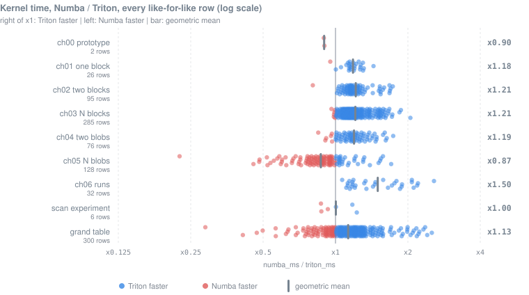
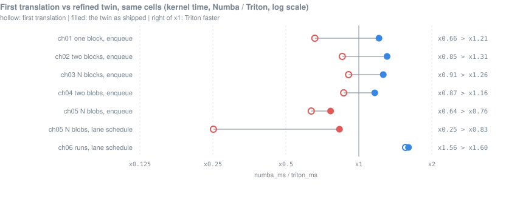
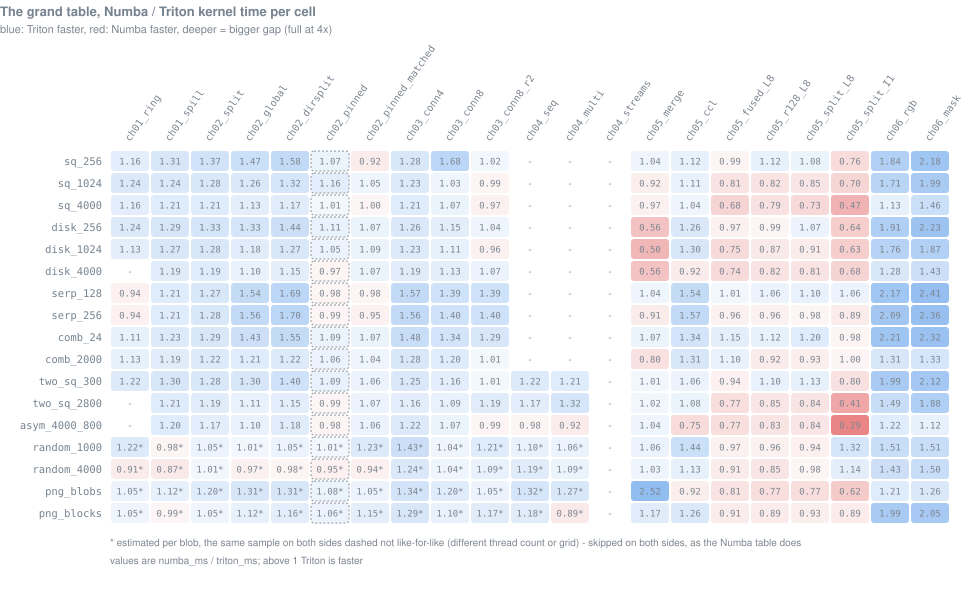

# Triton twins: every chapter, rebuilt in Triton

Every Numba kernel of chapters 0-6 and the scan experiment has a Triton
twin. Same algorithm, same host API, same tests against the same CPU
oracles, and a harness that times both backends on the same cells.

The question is simple: which of this repo's results belong to the
algorithm, and which to Numba? No PyTorch is involved. Triton launches on
CuPy memory, in the same process and CUDA context as Numba.

Every number below comes from the committed comparison JSON
(`results/triton_twins/<unit>/compare_*.json`) or from
[`summary.json`](../results/triton_twins/summary.json), which
`compare/summary.py` rolls up from them.

**Speedup is `numba_ms / triton_ms`: above x1, Triton is faster.**

---

## The headline

| | |
|---|---|
| units compared | 9: ch00-ch06, the scan experiment, the grand table |
| rows timed | 1,214, of which 934 like-for-like |
| outputs | **identical on every timed run of every row** |
| kernel time | **Triton x1.12** overall (geometric mean of the 9 unit means) |
| Triton faster | 738 of the 934 like-for-like rows |
| total time | x1.32, mostly CuPy's allocator and copies, not the kernels |
| where Triton still loses | ch05 (x0.87) and the ch00 prototype (x0.90) |
| the first translation | **x0.91**: two translation choices, not Triton, made the difference |



*One dot per like-for-like row, the bar is the unit's geometric mean.
Blue: Triton faster. Red: Numba faster.*

---

## Per unit

What is twinned, and how much of it is tested. Test counts are collected
test ids (parametrized cases counted). ch00 and the scan experiment had
no Numba tests: their twins brought their own.

| unit | what is twinned | tests: Numba / twin | twin README |
|---|---|---|---|
| ch00 prototype | the one-block `single_block.py`, flaws included (non-wrapping queue, claim before the red test) | - / 90 | [ch00](chapters/ch00_cpu_baseline/README.md) |
| ch01 one block | v1 ring and v2 spill BFS | 48 / 155 | [ch01](chapters/ch01_gpu_1blob_1block/README.md) |
| ch02 two blocks | `global`, `split`, `dirsplit` (+ bare twins), `pinned` | 102 / 271 | [ch02](chapters/ch02_gpu_1blob_2block/README.md) |
| ch03 N blocks | the 8 kernels: conn4, conn8, r2, wc, each instrumented and bare | 133 / 817 | [ch03](chapters/ch03_gpu_1blob_nblock/README.md) |
| ch04 two blobs | the 10 kernels (lin / xy entries, conn4 / conn8 / r2, bare) and the 3 modes | 75 / 476 | [ch04](chapters/ch04_gpu_2blob_nblock/README.md) |
| ch05 N blobs | `seed_merge`, `ccl_fill`, the lattice builds (fused, r128, split) and both probes: 12 kernels | 208 / 857 | [ch05](chapters/ch05_gpu_nblob_nblock/README.md) |
| ch06 runs | the run pipeline: pack, count, row_scan, emit, merge, flatten, paint, label, unpack | 109 / 270 | [ch06](chapters/ch06_gpu_nblob_runs/README.md) |
| scan experiment | `scan_image_small_example`, `simple_scan_kernel` | - / 40 | [scan](experiments/scan_multi_blob/README.md) |
| grand table | every GPU column runner of the overview, on its 17 scenes | - / 28 | [`compare/overview.py`](compare/overview.py) |

Add the runtime (12) and the harness and summary (11): **3,027 twin tests**.

What the final run measured. "rows" counts everything timed; the like-for-like
rows are the ones every average uses (see [Method](#method)).

| unit | rows (like-for-like) | outputs equal | kernel | total | best for Triton | worst for Triton |
|---|---|---|---|---|---|---|
| ch00 | 4 (2) | all | x0.90 | x1.26 | x0.90, `fixed_scene` seed 0 | x0.89, `profile_kernel`, 100 scenes |
| ch01 | 37 (26) | all | x1.18 | x1.22 | x1.44, ring tpb 512, `sq_2000_center` * | x0.95, ring, `serpentine_256` |
| ch02 | 125 (95) | all | x1.21 | x1.23 | x1.73, split, `sq_256_center` | x0.80, dirsplit bare, `sq_1024_center` |
| ch03 | 357 (285) | all | x1.21 | x1.18 | x2.05, conn4 48x256, `sq_256_center` | x0.96, conn8 bare 48x256, `sq_1024_center` |
| ch04 | 100 (60) | all | x1.20 | x1.10 | x1.74, multi8, `two_disks_r1400` | x0.85, bare multisource 72 blocks, `two_disks_r1400` |
| ch05 | 224 (128) | all | **x0.87** | x1.22 | x1.70, ccl bare, `serpentine_256` | **x0.22**, cclp probe, `serpentine_256` (0.29 vs 1.29 ms) |
| ch06 | 44 (32) | all | **x1.50** | x1.48 | x2.57, mask, `crop_1000` | x1.07, rgb, `crop_7000` |
| scan | 6 (6) | all | x1.00 | x2.02 | x1.23, `small_example` | x0.87, `early_stop`, white |
| grand table | 317 (300) | all | x1.13 | x1.39 | x2.52, ch05 merge, `png_blobs` | x0.29, ch05 split_I1, `asym_4000_800` |

\* Reproduced in a separate probe, not root-caused: from 256 to 512
threads Numba's ring barely speeds up while Triton's does.

---

## The story: two translation choices

The first translation of every chapter was faithful, and it lost. The
first full run (commit `35a0f54`, kept in `results/`) gave x0.91 overall.

Analysis traced the losses to two spelling choices, not to Triton. Both
were rewritten. The first spelling stays behind a switch and is measured
in the same harness as ablation rows.

| unit | first run | final | what changed |
|---|---|---|---|
| ch00 | x0.94 | x0.90 | nothing (run-to-run spread) |
| ch01 | x0.94 | x1.18 | per-lane enqueue |
| ch02 | x0.79 | x1.21 | per-lane enqueue |
| ch03 | x0.93 | x1.21 | per-lane enqueue |
| ch04 | x0.90 | x1.20 | per-lane enqueue |
| ch05 | x0.61 | x0.87 | lane-independent union-find, then per-lane enqueue |
| ch06 | x1.36 | x1.50 | lane-independent merge and flatten |
| scan | x0.99 | x1.00 | nothing |
| **these 8 units** | **x0.91** | **x1.12** | |

*First-run figures: `summary.py`'s own functions applied to the first-run
JSONs. The two runs time nearly the same cells: 635 and 634 like-for-like
rows.*



### 1. The enqueue: per program vs per lane

Numba appends to its queues per warp, by hand: `activemask`, `popc`, one
leader atomic, `shfl` of the base. Triton has no warp intrinsics.

So the first translation aggregated over the whole program instead:
`tl.sum` for the count, `tl.cumsum` for the ranks, one atomic. Those are
CTA reductions through shared memory.

| kernel (tpb 256) | `BAR.SYNC`, per lane | `BAR.SYNC`, first translation |
|---|---|---|
| ch01 v2 spill (Numba: 4) | 4 | 40 |
| ch03 conn4 / conn8 | 15 / 15 | 43 / 71 |
| ch03 r2 / wc | 21 / 15 | 189 / 22 |
| ch05 `ccl_fill` | 47 | 110 |

That is 7 extra barriers per append site (9 per direction in ch01's
two-tier form). Every direction of every tile held the program's 8 warps
together. With one active lane, one append cost 0.28-0.31 us.

The fix is the plainest code: one masked `tl.atomic_add` per winning
lane. ptxas sees a warp-uniform address and builds Numba's pattern
itself. One site of ch03's `multi_block_global_kernel`, condensed:

```
VOTEU.ANY UR6                    active mask          (Numba: activemask)
FLO.U32, POPC                    leader, count        (Numba: ffs, popc)
@P2 ATOMG.E.ADD.STRONG.GPU       one atomic per warp
S2R SR_LTMASK, LOP3, POPC        rank
SHFL.IDX                         base from the leader (Numba: shfl_sync)
```

No CTA barrier. Only details differ: ptxas elects the highest lane as
leader, Numba the lowest. Triton does not promise this, so the ch01-ch05
tests check the SASS of every build.

The last column is the twin against itself: first-translation
`triton_ms` over default `triton_ms`, on the same cells.

| paired cells (`summary.json`) | cells | first translation | per lane | Triton, default vs first |
|---|---|---|---|---|
| ch01 enqueue | 5 | x0.66 | x1.21 | 1.82x faster |
| ch02 enqueue | 13 | x0.85 | x1.31 | 1.53x |
| ch03 enqueue | 26 | x0.91 | x1.26 | 1.38x |
| ch04 enqueue | 16 | x0.87 | x1.16 | 1.30x |
| ch05 enqueue | 16 | x0.64 | x0.76 | 1.20x |

ch05 gains least. Its fill is not a plain BFS: unions at collisions still
hold the warps together (below).

### 2. Union-find: lockstep vs per lane

Numba's `_find` and `_union` are per-thread `while` loops. A thread that
reaches its root moves on, while its neighbours still climb.

A Triton program has no per-lane control flow. The first translation ran
each loop while any of its 256 lanes still looped, with a program-wide
`tl.max` on every trip.

In ch05 that cost twice (`two_disks_r1400`, counting copies of both
kernels):

| merge | Numba | lockstep twin |
|---|---|---|
| parent loads | 0.34 G | 3.11 G |
| warp-steps issued | 23.3 M | 364 M |
| forest depth after the merge, mean / max | 4.1 / 44 | 41 / 147 |

Wasted lane slots, and a forest ten times deeper. Programs advance at
their slowest lane's pace, drift apart, and link into regions not merged
yet.

The width test confirms it. Same 12,288 threads, `ccl_fill` merge: Numba
30-36 ms at every block size. The lockstep twin: 104, 159, 347 and 556
ms at 32, 64, 128 and 256 lanes per program.

In ch06 path halving kept the forest at Numba's depth. The cost was the
lockstep alone: `input_blobs` merge 0.600 ms against Numba's 0.307
(GPU-only, x0.51).

The fix makes each lane a small state machine. It keeps its own
grid-stride item, its place in it, and its union in flight.

Cheap work (one parent hop, one probe) runs in mini-steps, where warps
never wait. The rare work (the link atomic, fetching the next item) runs
at a full step, every 8 (ch05) or 4 (ch06) mini-steps.

| paired cells (`summary.json`) | cells | lockstep | per lane | Triton, default vs first |
|---|---|---|---|---|
| ch05 lane schedule | 14 | x0.25 | x0.83 | 3.21x faster |
| ch06 lane schedule | 6 | x1.56 | x1.60 | 1.02x |

ch06's harness rows are pipeline spans, mostly launch-bound, so they
hide the change. GPU-only, the `input_blobs` merge went from x0.51 to
x1.13 (0.272 ms).

Both refinements are the defaults. `enqueue="program"` and
`lane_schedule="lockstep"` bring the first translation back. Both
spellings give identical outputs (tested against each other and
against Numba).

---

## Why Triton wins where it wins

Most of Triton's margin is **incidental**: properties of two
implementations, not of the language.

| cause | evidence | kind | where it decides |
|---|---|---|---|
| **The grid barrier.** Triton's `grid_sync` is inline: CTA barrier, release arrive, acquire spin. Numba's `grid.sync()` calls `cudaCGSynchronize` in libcudadevrt, which traps to a driver syscall | per level pair, Triton vs Numba: 0.93 vs 1.81 us at 1 block, 1.25 vs 2.54 at 48, 1.64 vs 5.29 at 144 | incidental | one-pixel levels: ch03 wc on the serpentine (x1.58 in the first run) is this alone |
| **Per-pixel code.** Triton emits straight-line, predicated int32 code. Numba carries 64-bit index math and `div.s64` calls | ch01 ring SASS: 392 lines vs 1,144. ch03 conn4: 38 registers vs 104 | incidental | +5-20% per pixel once the enqueue is barrier-free |
| **The host launch path.** Numba marshals every array as a struct, built in Python per launch | ch06 `emit`: 51 kernel params vs 12. One launch: 27-53 us vs 14-19 us | host stack | sub-ms rows, ch06's small scenes |
| **The allocator.** CuPy's pool returns a warm block. Numba's `device_array` calls `cuMemAlloc` every time | one allocation, 30 KB-64 MB: 0.01-0.06 ms vs 0.06-1.05 ms | host stack | `total_ms` everywhere; the scan's x2.02 |

The last two are not kernel speed. A Numba program that allocated
through CuPy would get the allocator gain too.

**ch06 (x1.50)** is mostly the launch path. Its `kernel_ms` is a CUDA-event
span, so on small scenes it includes the GPU waiting for Python.

| ch06 rows | span (`kernel_ms`) | GPU-only |
|---|---|---|
| all 32 | x1.50 | x1.17 |
| 18 launch-bound | x1.79 | x1.17 |
| 14 GPU-bound | x1.19 | x1.18 |

GPU-only, Triton wins the warp-centric phases: pack x1.22, count x1.35,
scan x1.42, emit x1.25, paint x1.34. It still trails on the thread-per-run
phases: merge x0.97, flatten x0.87.

## Why Triton loses where it loses

Most of what is left is **structural**: things Triton cannot say.

| cause | evidence | kind | where it shows |
|---|---|---|---|
| **No user-addressable shared memory.** Queues, rings and block clocks live in global scratch, with L2 atomics | GPU-only: ch00 x0.87 (436 vs 500 us), scan x0.89 | structural | one-block, latency-bound kernels. The BFS rings do not mind: the twin's global ring beat Numba's shared one |
| **No per-lane control flow.** State machines recover most of it, not all | ch05 `ccl_fill` merge on `asym_4000_800`: still 1.9x Numba's time. ch06 flatten: x0.86-0.88 on the big scenes | structural | union-find on long, coherent chains |
| **No warp scope.** Anything aggregated by hand over a program is CTA-wide | ch05's `seed_merge` fill starts each level with per-direction batches whose collision `_union` runs in lockstep. Its final flatten keeps the lockstep find, the faster of the two spellings (`comb_2000`: 52 ms vs Numba's 26) | structural | ch05's `seed_merge` and lattice builds |
| **Bigger default grids.** Fewer registers give Triton 1.5-3x Numba's co-resident capacity | own-default rows (each backend at its own `blocks=None`): ch03 x0.87, ch04 x0.85. Extra programs only add barrier arrivals | incidental (a grid policy) | `comparable=false` rows only |

Two cases where a chain defeats the per-lane schedule:

- ch06 `blob_grid_100`: merge x1.48 in lockstep, x0.73 per lane. Lockstep
  links each 360-run chain while every find still reads the identity.
  Free lanes lose that race at some program boundaries, and one lane
  walks up to 181 hops.
- ch05 cclp on `serpentine_256` got worse with the refinement: x0.60 in
  the first run, x0.22 now. Not root-caused; one long chain is the same
  shape, so that race is the first suspect.

**ch05 (x0.87)** is all of the above at once. Triton wins 30 of its 128
like-for-like rows, 20 of them in the benchmark experiment (x0.93).

Its best are `ccl` on the serpentine (x1.57-1.70, about 33k barrier
levels, consistent with the cheaper grid barrier) and on the comb
(x1.30-1.32). The seeding and tuning sweeps lose: 9 wins in 72 rows,
x0.89 and x0.81.

**ch00 (x0.90) and scan (x1.00)** trail on the GPU and win back part of
it on the launch path. scan's x1.00 is not parity: its two
`small_example` rows are almost pure launch (x1.18-1.23), its four
working rows x0.87-1.00.

---

## The grand table

The Numba overview's grand table (every approach x every shape x scale,
[`site/index.html`](../../../site/index.html)), re-measured cell by cell
against the twins.

- **The Numba table's 17 scenes x 20 GPU columns:** 300 cells timed,
  40 skipped on both sides as the Numba table skips them. The skips:
  ch04 streams (17), ch04's other two columns on the 10 one-blob rows
  (20), the ch01 ring's overflow (3).
- **Plus one like-for-like column** the Numba table lacks: ch02 pinned
  at 2 x 512 on both sides. **317 rows** in all, outputs identical, the
  pixel crosscheck OK on all 17 scenes, 81 Mpx `input_blobs.png`
  included.
- **48 cells are estimated** from a per-blob (or per-pair) sample, as
  the Numba table does for one- and two-blob kernels on N-blob rows. The
  sample is the same on both sides.
- Grids are pinned to min(Numba capacity, Triton capacity), which on
  this GPU is always Numba's own launch.



Per column, like-for-like cells:

| column | cells | Triton faster | kernel | total |
|---|---|---|---|---|
| ch01 ring | 14 | 11 | x1.10 | x1.35 |
| ch01 spill | 17 | 14 | x1.17 | x1.38 |
| ch02 split | 17 | 17 | x1.21 | x1.38 |
| ch02 global | 17 | 16 | x1.23 | x1.40 |
| ch02 dirsplit | 17 | 16 | x1.30 | x1.45 |
| ch02 pinned, 2 x 512 both | 17 | 12 | x1.04 | x1.29 |
| ch03 conn4 | 17 | 17 | x1.30 | x1.39 |
| ch03 conn8 | 17 | 17 | x1.18 | x1.38 |
| ch03 conn8 r2 | 17 | 13 | x1.10 | x1.31 |
| ch04 sequential | 7 | 6 | x1.16 | x1.07 |
| ch04 multisource | 7 | 5 | x1.10 | x1.04 |
| ch05 seed_merge | 17 | 10 | x0.95 | x1.27 |
| ch05 ccl_fill | 17 | 14 | x1.17 | x1.45 |
| ch05 fused_L8 | 17 | 3 | x0.89 | x1.43 |
| ch05 r128_L8 | 17 | 4 | x0.92 | x1.47 |
| ch05 split_L8 | 17 | 5 | x0.94 | x1.48 |
| ch05 split_I1 | 17 | 3 | **x0.73** | x1.33 |
| ch06 rgb | 17 | 17 | x1.62 | x1.57 |
| ch06 mask | 17 | 17 | **x1.78** | x1.69 |
| **the table** | **300** | **217** | **x1.13** | **x1.39** |

ch02 pinned as the Numba table runs it (2 x 768 threads) has no
like-for-like twin: Triton needs a power of 2. Its 17 cells are timed
against the twin's 2 x 512 (x1.04) and stay out of the averages.

The table repeats the chapters' verdict. Triton leads the BFS columns
and ch06, and loses only the ch05 lattice builds and `seed_merge`.

---

## What Triton could not express

How each missing construct was spelled. "Fidelity" follows the twin
READMEs: exact, close, emulated.

| CUDA / Numba construct | Triton spelling in the twins | fidelity | details |
|---|---|---|---|
| `grid.sync()` | `runtime.device.grid_sync`: a monotonic counter, CTA barrier, release arrive, acquire spin, under `launch_cooperative_grid=True` | emulated (and cheaper) | [ch02](chapters/ch02_gpu_1blob_2block/README.md#mapping), [ch03](chapters/ch03_gpu_1blob_nblock/README.md#mapping) |
| `max_cooperative_grid_blocks(tpb)` | `runtime.occupancy.max_coresident_programs(compiled)` | close: same formula, Triton's own registers | [ch03](chapters/ch03_gpu_1blob_nblock/README.md#deviations) |
| `cuda.shared.array` (rings, queues, scalars, block clock) | global scratch, served by L1/L2; volatile loads for re-reads | emulated | [ch00](chapters/ch00_cpu_baseline/README.md#mapping), [ch01](chapters/ch01_gpu_1blob_1block/README.md#mapping), [scan](experiments/scan_multi_blob/README.md#mapping) |
| warp enqueue (`activemask`, `popc`, leader atomic, `shfl_sync`) | one masked `tl.atomic_add` per lane; ptxas emits the warp aggregation | close: same SASS pattern | [ch01](chapters/ch01_gpu_1blob_1block/README.md#enqueue-per-lane-warp-aggregated-by-ptxas), [ch03](chapters/ch03_gpu_1blob_nblock/README.md#enqueue-per-lane-default-and-per-program-first-translation), [ch04](chapters/ch04_gpu_2blob_nblock/README.md#the-enqueue-switch-enq) |
| warp vote, reduction and scan (`ballot_sync`, `shfl_down`, `shfl_up`) | `tl.reduce(or)`, `tl.sum`, `tl.cumsum` along the lane axis of a `[warps, 32]` tile | close (the vote) and exact; the vote and the sum compile to one `redux.sync` per warp | [ch06](chapters/ch06_gpu_nblob_runs/README.md#mapping) |
| per-thread divergent loops (`_find`, `_union`, search, walk) | per-lane state machines; `lane_schedule="lockstep"` keeps the first translation | emulated | [ch05](chapters/ch05_gpu_nblob_nblock/README.md#lockstep-vs-lane-independent-union-find), [ch06](chapters/ch06_gpu_nblob_runs/README.md#lockstep-vs-lane-independent-merge-and-flatten) |
| per-warp branch (`if interior:` ring-2 skip) | per-program skip on a `tl.max` gate | close: neutral by ablation (0.98-1.01) | [ch04](chapters/ch04_gpu_2blob_nblock/README.md#deviations) |
| masked `atomic.cas` on a 0/1 flag | masked `tl.atomic_xchg(..., 1)`, `old == 0` wins | close: same exactly-once claim | every chapter |
| `break`, `continue` | folded into the `while` condition, or a lane mask | exact | [ch01](chapters/ch01_gpu_1blob_1block/README.md#mapping), [scan](experiments/scan_multi_blob/README.md#mapping) |
| block sizes that are not a power of 2 (96, 100, 768 threads) | `ValueError` naming the power-of-2 rule; scan's 100 threads run as 128 masked lanes | not reproducible | [ch02 pinned](chapters/ch02_gpu_1blob_2block/README.md#deviations) |
| linked `smid.cu` (`%smid`, `%clock64`, `%globaltimer`) | inline PTX: `read_smid`, `read_clock64`, `read_globaltimer` | exact | [ch05](chapters/ch05_gpu_nblob_nblock/README.md#mapping) |
| device `print` (ch00's exit print) | a state slot the host reads | close | [ch00](chapters/ch00_cpu_baseline/README.md#deviations) |
| `max_registers=` | `maxnreg=` launch option | close: Triton's register counts are its own | [ch05](chapters/ch05_gpu_nblob_nblock/README.md#deviations) |
| a device without PyTorch (Triton finds it through torch) | `runtime/bridge.py`: a CuPy-backed driver, sharing Numba's primary context | - | [`runtime/bridge.py`](runtime/bridge.py) |

---

## Method

### The harness ([`compare/harness.py`](compare/harness.py))

| rule | why |
|---|---|
| each chapter's `compare.py` builds its cases from the Numba benchmarks' own scenes, configs and grids | the same cells, never a friendlier set |
| both backends warm up on each case first | no JIT or Triton compile lands in a timing |
| rounds alternate N T, T N, ...; the count is made even | the clock drifts within a session; each backend goes first equally often |
| deterministic outputs are compared on **every** timed run | a fast wrong answer cannot hide (the grand table compares sha1 digests) |
| the median of the drivers' own brackets is reported | the repo's existing timing convention, unchanged |
| 8 s spin-up first; SM clock, power and temperature recorded after each row | an idle laptop GPU sits at a third of its clock |
| both memory pools released between cases | VRAM and 6 GB of host RAM are shared by three runtimes |

### The timing brackets

| field | ch00-ch05, scan (and their grand-table cells) | ch06 (and its grand-table cells) |
|---|---|---|
| `kernel_ms` | `perf_counter` around launch + synchronize; host launch path included | CUDA-event span of the pipeline; includes the GPU waiting on Python when launch-bound. `gpu_only` re-times it behind a 3 ms device spin |
| `total_ms` | adds allocation, H2D and D2H, each through its own stack | host wall time of `run()` + synchronize |

Read `kernel_ms`. `total_ms` compares CuPy with Numba's host stack as
much as the kernels.

### The flags

| flag | meaning | in the averages? |
|---|---|---|
| `comparable=false` | not like-for-like: each backend at its own `blocks=None`, a thread count Triton cannot run (2 x 768), or extra work on one side (ch00's printf rows) | no; reported per unit as "own default" |
| `first_translation=true` | the first spelling of a construct, kept as an ablation | no; paired with its default row in `first_translation_ablations` |
| `duplicate_of` | a cell another experiment of the unit already times (ch04 keeps it inside `config`) | no; each cell counts once |

Averages are geometric means over like-for-like rows. "Overall" is the
geometric mean of the 9 unit means. The grand table's 300 cells weigh as
much as ch00's 2.

### Machine and clocks

- RTX 4060 Laptop (24 SMs), WSL2 Ubuntu on Windows 11. Numba 0.65.1,
  Triton 3.7.1, CuPy 14.1.1, CUDA driver 13.3, Python 3.10.12.
- The SM clock tops out at 3105 MHz. Rows sat at a median 2070 MHz in
  every unit but two: ch00 at 735 MHz (one 64-thread block lets it
  fall) and ch04 at 1830 MHz.
- Samples within one row spread 15-20%. All ratios are taken inside one
  interleaved set of rounds.

### WSL caveats

- Every driver call (allocation, pageable copy, launch) crosses into the
  Windows host. Host costs are higher than on native Linux: trust the
  ratios more than the microseconds.
- GPU performance counters are blocked under WSL (`ERR_NVGPUCTRPERM`), so
  there is no `ncu`. Attribution rests on SASS and PTX counts, counting
  copies of kernels, microbenchmarks and ablations.
- Concurrent cooperative launches can wedge the GPU. One GPU job at a
  time; the runs took a lock.

### Memory pressure

- The host has 6 GB, shared by Numba, CuPy and Triton. The harness
  frees both pools between cases.
- ch03 drops its 64 Mpx scene: holding a Numba and a Triton result at
  once would pass its 2.5 GB host budget.
- The grand table checks free memory before every row above 20 Mpx
  (`png_blobs` needed 3,138 MB of 3,474 MB available). It peaked at
  4,576 MB of host RSS.
- The first run's ch03 overlapped another project's 2.9 GB job for its
  last 11 minutes (commit `35a0f54`).

### First-run data, kept

The first translation's run stays in `results/triton_twins/<unit>/`: the
`compare_20261002T13*Z.json` and `compare_20261002T14*Z.json` files, 705
rows. `summary.py` reads only the newest file per unit, so they never
enter an average. They are the "first run" column above.

---

## Run

One GPU job at a time. Each command below needs the GPU unless it says
CPU only.

```bash
# Tests: every twin suite (3,027 collected), or one chapter
uv run pytest src/flood_fill_cuda/triton_twins
uv run pytest src/flood_fill_cuda/triton_twins/chapters/ch03_gpu_1blob_nblock

# Numba vs Triton for one unit; writes results/triton_twins/<unit>/compare_<UTC>.json
uv run python -m flood_fill_cuda.triton_twins.chapters.ch03_gpu_1blob_nblock.compare
uv run python -m flood_fill_cuda.triton_twins.chapters.ch03_gpu_1blob_nblock.compare --quick   # smoke test, no JSON
uv run python -m flood_fill_cuda.triton_twins.experiments.scan_multi_blob.compare

# The grand table (the final run took 49 minutes); --estimate-only prints the plan
uv run python -m flood_fill_cuda.triton_twins.compare.overview
uv run python -m flood_fill_cuda.triton_twins.compare.overview --estimate-only

# CPU only: summary.json from the newest JSON per unit, then the three figures
uv run python -m flood_fill_cuda.triton_twins.compare.summary
uv run python -m flood_fill_cuda.triton_twins.compare.figures
```

The same `chapters.<unit>.compare` module exists for every chapter
ch00-ch06. Each twin README lists its experiments and options.

---

## Layout

```
triton_twins/
  runtime/      the CuPy bridge (no torch), grid_sync and cta_sync, masked CAS,
                %smid / %clock64 / %globaltimer, occupancy, the copy-peak probe
  compare/      harness.py (the method), summary.py, figures.py,
                overview.py (the grand table's twin)
  chapters/     ch00_cpu_baseline .. ch06_gpu_nblob_runs, the Numba chapters'
                own folder names: kernels, driver, tests, compare.py, README
  experiments/  scan_multi_blob
```

Scenes, CPU oracles, result types and counter slots are imported from
the Numba chapters, never copied, so the two sides cannot drift apart.

The older Triton-only experiment,
[`experiments/triton`](../experiments/triton/README.md), now runs on this
runtime too. It has no Numba counterpart, so it has no twin.
